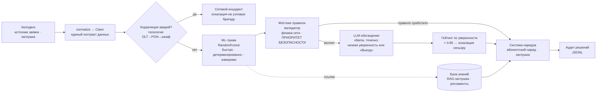
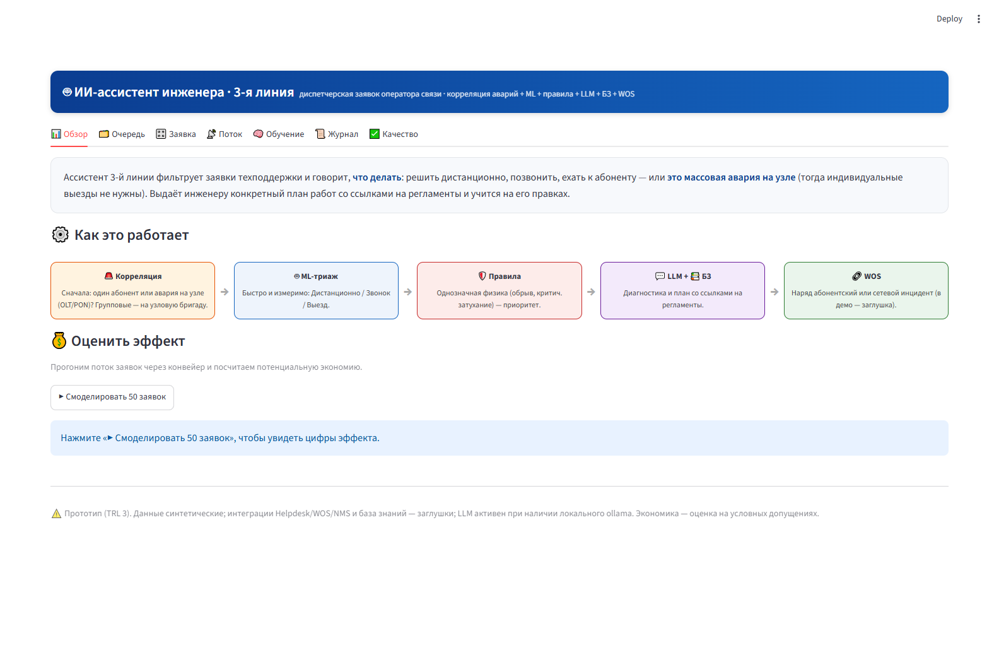
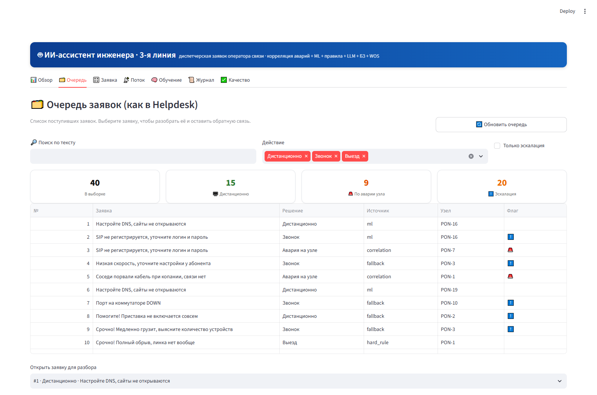
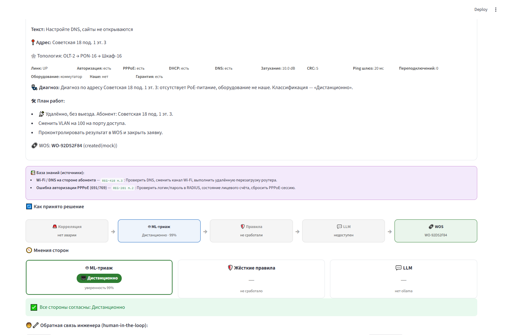
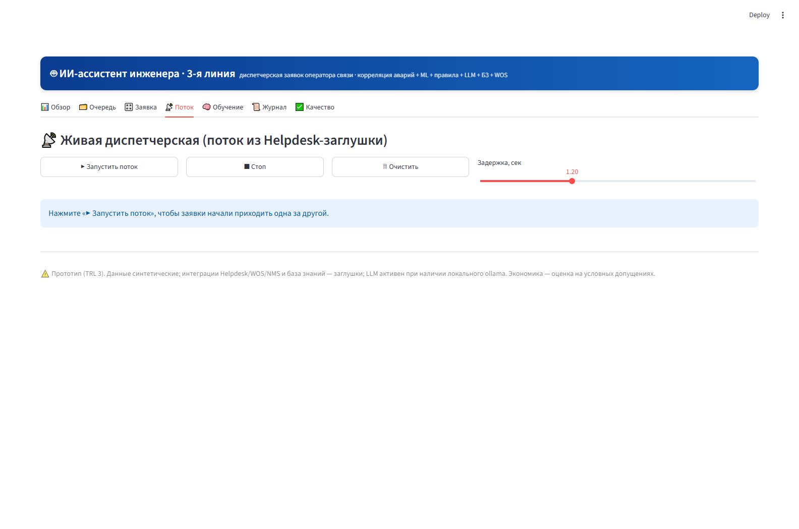
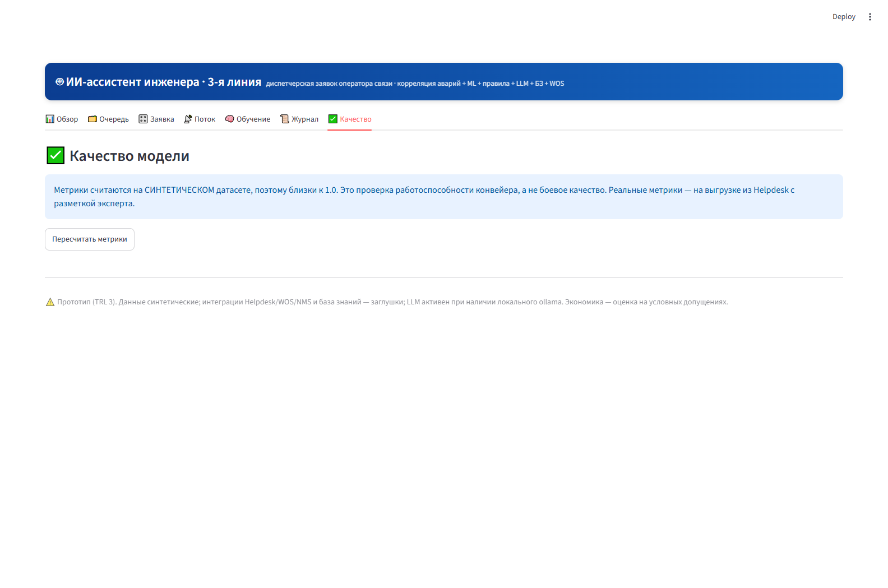

# 🤖 ИИ-ассистент триажа заявок сервисной службы провайдера

**AI Triage Assistant for ISP Field Service** — конвейер классификации заявок
технической поддержки: **Дистанционно / Звонок / Выезд** + конкретный план
работ для выездного инженера.

[](https://github.com/Gopota58/isp-triage-assistant/actions)
[](LICENSE)
[]()

> **Статус: TRL 3 — proof of concept.** Это рабочий *макет архитектуры*,
> а не боевая система. Данные **синтетические**, интеграции (хелпдеск /
> система нарядов / NMS) — **заглушки**. Метрики ≈ 0.99 — свойство игрушечных
> правил, а не реальное качество; честно — в разделе
> [«Что это на самом деле»](#-честно--что-это-на-самом-деле).

---

## 🌍 Почему гибрид, а не «чистый LLM»

Триаж заявок — задача с **несимметричной ценой ошибки**: ложное «решим
дистанционно» при обрыве магистрального кабеля = сорванный SLA и десятки
недовольных абонентов. Поэтому конвейер гибридный:



1. **Сначала корреляция аварий** — главный вопрос 3-й линии: *«это один
   абонент или авария на узле?»*. Заявки детерминированно мапятся на
   топологию OLT→PON→шкаф; всплеск заявок на одном PON схлопывается
   в один сетевой инцидент вместо N отдельных выездов.
2. **ML-триаж** (RandomForest поверх единого контракта признаков) —
   детерминированный и измеримый: честные метрики получаются сразу.
3. **Жёсткие правила-валидатор** — однозначная физика (порт DOWN,
   затухание ≥ 40 dB, шторм CRC, кабель перегрызен собакой…) **перебивает
   модель**: приоритет безопасности.
4. **LLM — опционально и точечно** — локальный ollama (llama3.2) генерирует
   диагноз и пошаговый план только для неуверенных случаев ML и «Выезда».
   Graceful fallback: без LLM система полностью работает в режиме
   ML + правила (шаблонные планы).
5. **RAG-ссылки на регламенты** — каждое решение подкреплено документами
   базы знаний (в демо — игрушечная БЗ).
6. **Гейтинг по уверенности** — ниже порога тикет уходит сеньор-инженеру,
   а не исполнителю вслепую.
7. **Human-in-the-loop** — правки инженера (👍 / ✏️ / 👎) пишутся в журнал;
   на накопленных метках можно дообучить модель в один клик.
8. **Аудит** — каждое решение одной JSON-строкой: кто / что / почему /
   с какой уверенностью.

## 🧭 Ключевые решения (design decisions)

| Решение | Зачем |
|---|---|
| Единый контракт данных `Claim` + `normalize()` | Две легаси-схемы (7 полей учёта, 24 поля FTTx-диагностики) сходятся в один источник правды; коннекторы остаются тонкими. |
| Правила выше ML | Асимметрия цены ошибки: пропущенный физический обрыв стоит дороже лишнего звонка. Плюс правила — якорь объяснимости. |
| LLM — обогащение, а не решающий | Контроль стоимости + детерминизм там, где он нужен: LLM пишет *план*, конвейер решает *маршрут*. |
| Только локальный ollama | On-prem-ограничение для телеком-данных (персональные данные абонентов); обладных LLM-вызовов в системе нет вообще. |
| Синтетика + честный дисклеймер | Воспроизводимое демо без утечки реальных данных абонентов; фреймворк `evaluate` готов считать метрики на реальной размеченной выборке. |
| Streamlit как макет диспетчерской | Скорость прототипирования UX; в бою — встраивание плагном/iframe в рабочее место инженера. |

## 📂 Структура

```
isp_triage/
  contract.py            единый контракт Claim + normalize() (легаси-схемы A/B)
  data/generate.py       генератор синтетики → data/claims.csv
  triage/classifier.py   ML-триаж (train / predict / evaluate, кэш модели)
  triage/rules.py        жёсткие правила-валидатор (высший приоритет)
  llm/engine.py          LLM-обогащение (ollama, graceful fallback)
  connectors/helpdesk.py     ЗАГЛУШКА read-only источника заявок
  connectors/workorders.py   ЗАГЛУШКА создания наряда / сетевого инцидента
  topology.py            модель сети доступа (OLT→PON→шкаф) + корреляция аварий
  kb.py                  мини-база знаний (RAG-заглушка) со ссылками на регламенты
  feedback.py            human-in-the-loop: журнал правок + метки для дообучения
  audit.py               журнал решений (JSONL)
  impact.py              оценка экономического эффекта (условные допущения)
  pipeline.py            оркестратор: корреляция → ML → правила → LLM → RAG → гейтинг → наряд → аудит
  cli.py                 команды train / evaluate / demo
  app.py                 Streamlit-диспетчерская (7 вкладок)
tests/                   31 pytest-тест (контракт, правила, конвейер, сервисы)
.github/workflows/ci.yml CI: train + evaluate + demo + pytest
```

## 🚀 Быстрый старт

```bash
pip install -r requirements.txt          # или: pip install -e ".[dev]"

python -m isp_triage.cli train           # сгенерировать синтетику + обучить ML
python -m isp_triage.cli evaluate        # accuracy / precision / recall / F1
python -m isp_triage.cli demo -n 5       # прогнать заявки через конвейер
python -m streamlit run isp_triage/app.py --server.headless true
                                         # → http://localhost:8501

pytest                                   # 31 тест
```

Опциональная LLM-ветка: установите `ollama`, подтяните `llama3.2`, запустите
локально — конвейер подхватит сам, без настройки.

### Пример вывода CLI

```
📝 #1 Настройте DNS, сайты не открываются
   ➜ Дистанционно  (источник: ml, уверенность: 0.99)
   💡 Диагноз по адресу Советская 18 под. 1 эт. 3: отсутствует PoE-питание…
      - 📡 Удалённо, без выезда. Абонент: Советская 18 под. 1 эт. 3.
      - Сменить VLAN на 100 на порту доступа.
      - Проконтролировать результат в WOS и закрыть заявку.
   🔗 WOS: WO-F63EAC98 (created(mock))
```

## 📸 Скриншоты диспетчерской

| Обзор и симулятор экономии | Очередь заявок (как в хелпдеске) |
|---|---|
|  |  |
| **Разбор заявки: трасса решения и план работ** | **Живой поток заявок** |
|  |  |
| **Вкладка «Качество»: метрики на синтетике (с оговоркой)** | |
|  | |

## 🧑‍💻 Дорожная карта до MVP

1. **Реальные данные:** read-only выгрузка из хелпдеска + разметка эксперта.
2. **Контракт:** наполнить `Claim` реальными полями (контракт уже есть).
3. **Честная метрика:** прогнать `evaluate` на реальной размеченной выборке.
4. **LLM как основной движок:** сейчас точечно — постепенно повышать роль.
5. **Боевая интеграция нарядов:** заменить заглушку `connectors/workorders.py`.
6. Встраивание в рабочее место инженера (плагин/iframe), RBAC, HA.

## 🤝 Честно — что это на самом деле

Это **макет архитектуры уровня L3** на синтетических данных: интеграции —
заглушки, база знаний — игрушечная, экономика — условные допущения
(выезд ≈ 2 000 ₽ / ≈ 2 ч). Метрики ~0.99 отражают простоту синтетики,
а не боевое качество. При этом **поведение** конвейера (корреляция аварий →
ML → правила → LLM → гейтинг → наряд → аудит) повторяет реальный поток
3-й линии провайдера.

<details>
<summary>English summary (для международных рекрутеров)</summary>

Hybrid triage pipeline for ISP field-service claims: outage correlation
(topology OLT→PON) → ML router (RandomForest on a unified feature contract)
→ hard physics rules that override the model → pinpoint local LLM (ollama)
for diagnosis and step-by-step engineer plans → confidence gating →
work-order stub → JSONL audit. Human-in-the-loop feedback and retraining
included. Streamlit dispatcher UI, 31 pytest tests, CI. TRL 3 prototype on
synthetic data — integrations are stubs by design.
</details>

## 📄 Лицензия

[MIT](LICENSE)
